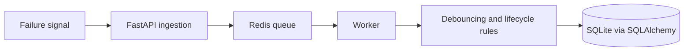

# Incident Management System

A production-style incident pipeline that accepts failure signals, processes them asynchronously, groups noisy events, and enforces an operational lifecycle with root-cause analysis.

  

## System flow



## Engineering highlights

- Queue-backed ingestion separates request latency from processing work
- Debouncing groups repeated failure signals into a single incident
- Explicit `OPEN → RESOLVED → CLOSED` lifecycle
- Root-cause analysis is required before closure
- Mean-time-to-resolution calculation
- Persistent relational state and a health endpoint

## Run locally

Prerequisites: Python 3.10+, Redis, and a POSIX shell.

```bash
git clone https://github.com/pankuprudhviraju1/incident-management-system.git
cd incident-management-system/backend
python3 -m venv .venv
source .venv/bin/activate
pip install -r requirements.txt

# Start Redis separately, then run the API
uvicorn app.main:app --reload

# In another terminal with the same environment
python -m app.workers.worker
```

## API surface

| Method | Route | Purpose |
| --- | --- | --- |
| `POST` | `/signal` | Ingest a failure signal |
| `GET` | `/incidents` | List incidents |
| `POST` | `/incident/{id}/rca` | Record root-cause analysis |
| `POST` | `/incident/{id}/close` | Close an eligible incident |
| `GET` | `/health` | Service health check |

## Design choices

- **Backpressure:** Redis absorbs bursts instead of doing all work in the request path.
- **Noise control:** debouncing prevents alert floods from inflating incident counts.
- **State integrity:** lifecycle rules keep resolution and RCA responsibilities explicit.
- **Separation of concerns:** API, worker, persistence, and domain rules are independently understandable.

## Production roadmap

Move to PostgreSQL, add durable retry/dead-letter semantics, structured metrics and traces, authentication and role-based access, real-time notifications, and load/failure testing.